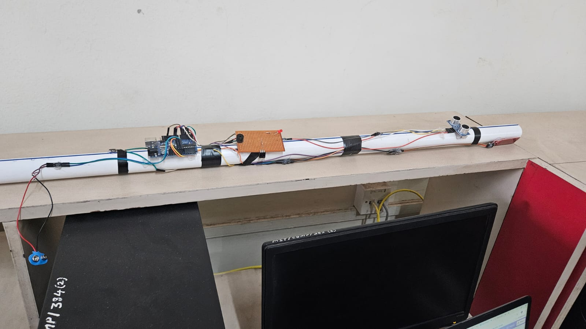

# **Smart Walking Cane (IOT)**

#### The cane uses HC-SR04 sensor to determine the distance between objects that may be in front of the user, buzzer when the object is close to the user, water level sensor to detect water fallen on the ground giving the input to the vibration motor to alert the user.

### Components:
- Arduino Uno(Rev-3)
- Water level sensor
- HC-SR04 (ultrasonic distance) sensor
- Piezo Buzzer
- Vibration Motor-ROB-08449
- Resistors
- Breadboard
- (Pipe used as a cane here)
- 9V Battery

```c++
distanceCm = time * 0.034 / 2;
/*
this takes the time required to leave
and reach HC-SR04 and calculates the distance
*/
```
----------

### Image


----------

### Breadboard view:


----------

### Circuit Diagram:

