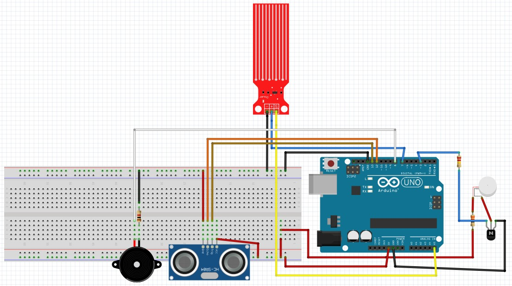
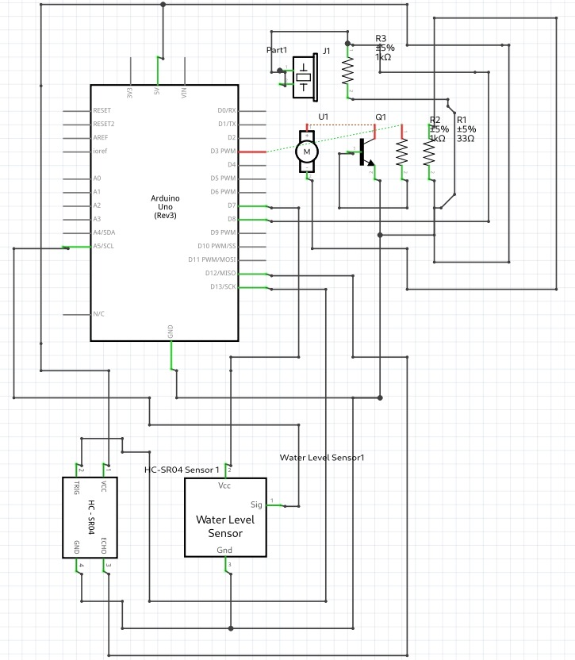

# Smart Walking Cane (IOT)

### Components:
- Arduino Uno(Rev-3)
- Water level sensor
- HC-SR04 (ultrasonic distance) sensor
- Piezo Buzzer
- Vibration Motor-ROB-08449
- Resistors
- Breadboard
- (Pipe used as a cane here)
- 9V Battery

```c++
distanceCm = time * 0.034 / 2;
/*
this takes into account the time required to leave
and reach HC-SR04 and calculates the distance
*/
```
----------

### Breadboard view:


----------

### Circuit Diagram:

